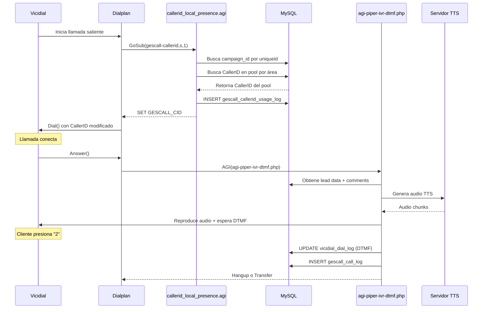

# GesCall - Guía de Replicación y Flujo de Llamadas

## Resumen del Sistema

GesCall es un sistema de gestión de llamadas para Vicidial que incluye:
- **CallerID Local Presence**: Asigna CallerID dinámico basado en el área geográfica del lead
- **IVR con TTS**: Reproduce mensajes personalizados con Text-to-Speech
- **Registro de Llamadas**: Log detallado con CallerID del pool y DTMF

---

## Arquitectura del Flujo de Llamada



---

## Archivos a Copiar

### 1. Dialplan de Asterisk

| Archivo | Ubicación | Descripción |
|---------|-----------|-------------|
| [extensions-gescall.conf](file:///etc/asterisk/extensions-gescall.conf) | `/etc/asterisk/` | Contextos GesCall |

**Contenido clave:**
```ini
; Incluir en /etc/asterisk/extensions.conf:
#include extensions-gescall.conf

; Contextos disponibles:
[gescall-callerid]      ; CallerID Local Presence
[gescall-piper-ivr]     ; IVR con TTS Piper
[gescall-playback-switch] ; Switch de reproducción
```

---

### 2. AGI Scripts

| Archivo | Ubicación | Lenguaje | Función |
|---------|-----------|----------|---------|
| [callerid_local_presence.agi](file:///var/lib/asterisk/agi-bin/callerid_local_presence.agi) | `/var/lib/asterisk/agi-bin/` | Perl | Asigna CallerID del pool |
| [agi-piper-ivr-dtmf.php](file:///var/lib/asterisk/agi-bin/agi-piper-ivr-dtmf.php) | `/var/lib/asterisk/agi-bin/` | PHP | IVR con TTS y captura DTMF |

---

### 3. Tablas de Base de Datos

Ejecutar las migraciones en orden:

```bash
mysql -u root -p asterisk < /opt/gescall/back/migrations/create_callerid_pools.sql
mysql -u root -p asterisk < /opt/gescall/back/migrations/create_gescall_call_log.sql
mysql -u root -p asterisk < /opt/gescall/back/migrations/create_whitelist_prefixes.sql
```

#### Esquema de Tablas

| Tabla | Propósito |
|-------|-----------|
| `gescall_callerid_pools` | Define pools de CallerIDs (ej: "Colombia", "Mexico") |
| `gescall_callerid_pool_numbers` | Números de CallerID con su área (LADA) |
| `gescall_campaign_callerid_settings` | Configuración por campaña (pool, estrategia) |
| `gescall_callerid_usage_log` | Log de qué CallerID se usó en cada llamada |
| `gescall_call_log` | Log completo con DTMF, duración, estado |
| `gescall_whitelist_prefixes` | Prefijos de números permitidos |
| `gescall_api_keys` | Claves API para acceso externo |

---

## Detalle de AGI: callerid_local_presence.agi

**Propósito**: Seleccionar CallerID del pool que coincida con el área del número destino.

**Flujo:**
1. Obtiene `phone_number` del lead
2. Extrae `area_code` (primeros 3 dígitos)
3. Busca `campaign_id` en `vicidial_auto_calls` por `uniqueid`
4. Busca configuración en `gescall_campaign_callerid_settings`
5. Selecciona CallerID según estrategia (ROUND_ROBIN, RANDOM, LRU)
6. Actualiza contadores y registra uso
7. Setea variable `GESCALL_CID` para el dialplan

**Variables AGI de salida:**
```
GESCALL_CID     = "3101234567"    ; CallerID seleccionado
GESCALL_RESULT  = "MATCHED"       ; MATCHED|FALLBACK|DEFAULT|NO_POOL
```

**Dependencias:**
- Perl con módulo `DBI`
- Usuario MySQL: `cron` / `1234`

---

## Detalle de AGI: agi-piper-ivr-dtmf.php

**Propósito**: Reproducir IVR personalizado con TTS y capturar DTMF.

**Flujo:**
1. Reproduce beep inicial
2. Obtiene `lead_id` del CallerIDName (V108...XXXXXXX)
3. Consulta `comments` del lead en `vicidial_list`
4. Tokeniza texto para cache de audio
5. Genera audio via API TTS remota (http://51.81.245.55:5000/tts)
6. Reproduce audio esperando DTMF "2"
7. Si presiona "2": transfiere a `xferconf_c_number` de la campaña
8. Registra DTMF en `vicidial_dial_log.context`
9. **Registra en `gescall_call_log`** (pool_callerid, dtmf, duración)

**Parámetros:**
```
AGI(agi-piper-ivr-dtmf.php,${lead_id})
```

**Dependencias:**
- PHP con extensiones `mysqli`, `curl`
- `sox` para conversión de audio
- Directorio TTS: `/var/lib/asterisk/sounds/tts/piper/`

---

## Configuración en Vicidial

### Para usar CallerID Local Presence:

1. **En la campaña**, configurar **Dial Prefix**:
   ```
   GoSub(gescall-callerid,s,1)|
   ```

2. **Crear pool de CallerIDs** via API o panel:
   ```sql
   INSERT INTO gescall_callerid_pools (name, country_code) VALUES ('Colombia', 'CO');
   INSERT INTO gescall_callerid_pool_numbers (pool_id, callerid, area_code) 
   VALUES (1, '3101234567', '310'), (1, '3112345678', '311');
   ```

3. **Asociar campaña al pool**:
   ```sql
   INSERT INTO gescall_campaign_callerid_settings 
   (campaign_id, rotation_mode, pool_id, match_mode, selection_strategy)
   VALUES ('MICAMPAÑA', 'POOL', 1, 'LEAD', 'ROUND_ROBIN');
   ```

### Para usar IVR con TTS:

1. Configurar el **Answer context** en el DID o campaña:
   ```ini
   [gescall-piper-ivr]
   exten => s,1,Answer()
   exten => s,n,AGI(agi-piper-ivr-dtmf.php,${ARG1})
   exten => s,n,Hangup()
   ```

2. El texto del IVR se toma del campo `comments` del lead.

---

## Comandos de Verificación

```bash
# Verificar AGIs instalados
ls -la /var/lib/asterisk/agi-bin/*.agi /var/lib/asterisk/agi-bin/*.php

# Verificar dialplan incluido
grep "#include" /etc/asterisk/extensions.conf

# Verificar tablas
mysql -u root -p asterisk -e "SHOW TABLES LIKE 'gescall%';"

# Ver últimos CallerIDs usados
mysql -u root -p asterisk -e "SELECT * FROM gescall_callerid_usage_log ORDER BY id DESC LIMIT 10;"

# Ver últimas llamadas registradas
mysql -u root -p asterisk -e "SELECT * FROM gescall_call_log ORDER BY id DESC LIMIT 10;"

# Probar sintaxis de AGIs
php -l /var/lib/asterisk/agi-bin/agi-piper-ivr-dtmf.php
perl -c /var/lib/asterisk/agi-bin/callerid_local_presence.agi
```

---

## Checklist de Instalación en Nuevo Servidor

- [ ] Copiar `/etc/asterisk/extensions-gescall.conf`
- [ ] Agregar `#include extensions-gescall.conf` en `/etc/asterisk/extensions.conf`
- [ ] Copiar `/var/lib/asterisk/agi-bin/callerid_local_presence.agi`
- [ ] Copiar `/var/lib/asterisk/agi-bin/agi-piper-ivr-dtmf.php`
- [ ] Dar permisos ejecutables: `chmod +x /var/lib/asterisk/agi-bin/*.agi /var/lib/asterisk/agi-bin/*.php`
- [ ] Ejecutar migraciones SQL
- [ ] Crear directorio TTS: `mkdir -p /var/lib/asterisk/sounds/tts/piper && chown asterisk:asterisk /var/lib/asterisk/sounds/tts/piper`
- [ ] Instalar dependencias Perl: `cpan DBI DBD::mysql`
- [ ] Verificar PHP tiene `mysqli` y `curl`
- [ ] Recargar dialplan: `asterisk -rx "dialplan reload"`
- [ ] Configurar pools y campañas en base de datos
