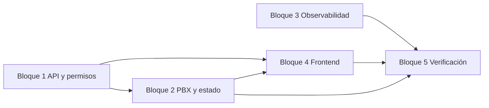

# Plan de trabajo — `supervisor-agent-actions`

Orden recomendado (cada bloque puede asignarse a un subagente). Los bloques 2–4 dependen de que existan rutas y contratos del bloque 1.

| Bloque | Tareas (`tasks.md`) | Entregables esperados |
|--------|---------------------|----------------------|
| **1** | 1.1–1.3 | Constantes de estados/policy, middleware supervisor, rutas REST stub o completas montadas en `app` |
| **2** | 2.1–2.5 | `supervisorCallService` (o similar), spy/whisper ARI/AMI, force-ready Redis+socket, logout remoto |
| **3** | 3.1–3.2 | Logs estructurados + notas compliance / flag env opcional |
| **4** | 4.1–4.3 | UI tabla tiempo real + API client + confirmaciones |
| **5** | 5.1–5.2 | Checklist manual + tests automatizados mínimos |

**Convención de subagentes:** un subagente por bloque (1–5), ejecutados **secuencialmente** 1→2→(3 y 4 pueden encadenarse tras 2)→5 para reducir conflictos en el mismo repo.

## Checklist manual (E2E)

- [ ] Supervisor autenticado con rol válido ejecuta `spy` sobre agente **ON_CALL** y recibe éxito (sin errores PBX).
- [ ] Supervisor intenta `spy`/`whisper` sobre agente fuera de llamada y la API responde rechazo claro (`409`).
- [ ] Supervisor ejecuta `force-ready` sobre agente en pausa (`PAUSED/NOT_READY`) y el estado pasa a `READY` en vista tiempo real.
- [ ] Supervisor intenta `force-ready` con agente `ON_CALL` y se rechaza sin mutar estado.
- [ ] Supervisor confirma `remote-logout`, agente pasa a `OFFLINE` y se observa desconexión de sesión/socket.
- [ ] Usuario sin rol supervisor intenta cualquier acción y la API responde `403` sin cambios sobre el agente.
